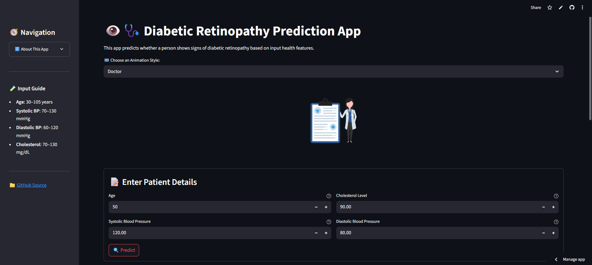
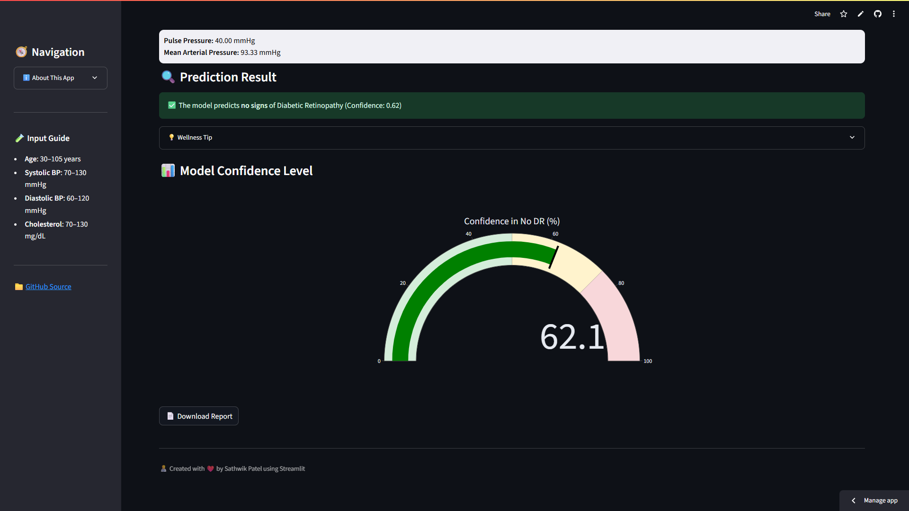

# 👁️ Diabetic Retinopathy Prediction App

This web application predicts the **presence or absence of Diabetic Retinopathy (DR)** using a simple set of patient inputs such as blood pressure, cholesterol, and age. It also calculates derived health indicators and provides medical guidance if DR is detected.

> 🚀 Built with **Streamlit**, **scikit-learn**, and **Plotly**  
> 🧠 Powered by a **Logistic Regression model** trained on synthetic healthcare data

---

## 🔍 Live Demo

🔗 [Click here to try the app](https://diabeticretinopathy2-may5gscbip9zr7bnbeivwb.streamlit.app/)

---

## 🩺 What Is Diabetic Retinopathy?

Diabetic Retinopathy is a **serious eye condition** caused by high blood sugar levels damaging the retina. Early detection is critical in preventing vision loss, especially for diabetic patients.

---

## 💡 Key Features

| Feature                           | Description                                                                 |
|-----------------------------------|-----------------------------------------------------------------------------|
| 🧪 Logistic Regression Model      | Lightweight and interpretable prediction using scikit-learn                |
| 🧠 Derived Health Metrics         | Calculates **Pulse Pressure** and **Mean Arterial Pressure**               |
| 📊 Prediction Confidence Gauge    | Visualizes how confident the model is in its prediction using a meter      |
| 🎬 Lottie Animation Integration   | Adds a dynamic and modern UI experience                                    |
| 🧾 PDF-like Downloadable Report   | Allows users to download a prediction summary                              |
| 🚨 Medical Alert System           | Alerts users with helpful links and action if DR is predicted              |
| 💬 Input Tooltips                 | Improves form usability with hover-based explanations                      |

---

## 📸 Screenshots

### 🔹 Input Form


### 🔹 Prediction Result with Confidence Gauge


---

## ⚙️ How It Works

1. User enters patient vitals via a simple form (Age, BP, Cholesterol)
2. The app:
   - Calculates derived features
   - Scales and passes the data to a logistic regression model
   - Predicts whether DR is likely present
3. The UI updates with:
   - A prediction message
   - A confidence gauge
   - A medical recommendation section
4. User can optionally download the prediction summary

---

## 📂 Project Structure

```bash
├── app.py                  # Main Streamlit app
├── diabetic_retinopathy_logistic_model.pkl
├── requirements.txt        # Python dependencies
├── README.md
└── images/                 # Folder for screenshots
````

---

## 🔐 Disclaimer

> This app is for **educational and demonstrative purposes only**. It is not a substitute for professional medical diagnosis or treatment. Always consult with a certified healthcare provider.

---

## 🙌 Acknowledgments

* Inspired by real-world medical ML applications
* Special thanks to [Streamlit](https://streamlit.io/) and the open-source community

